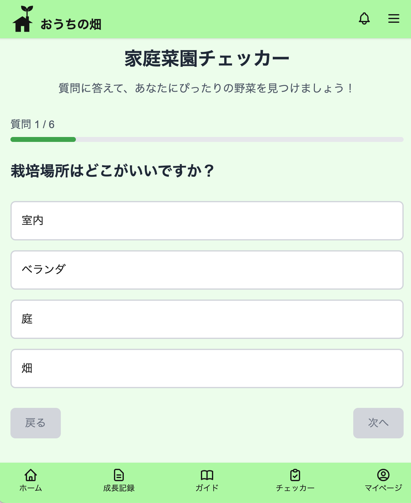
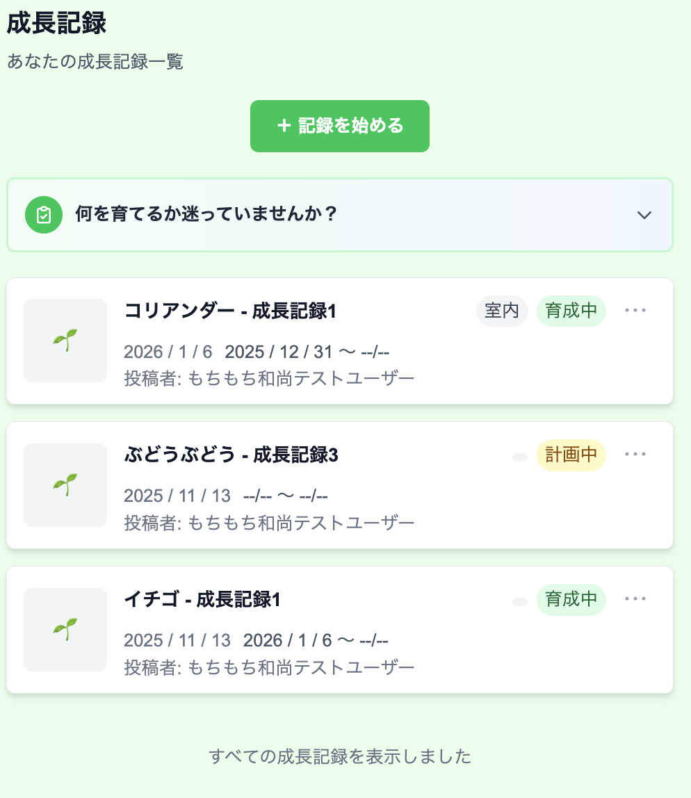
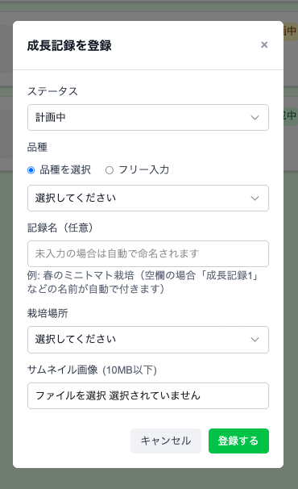
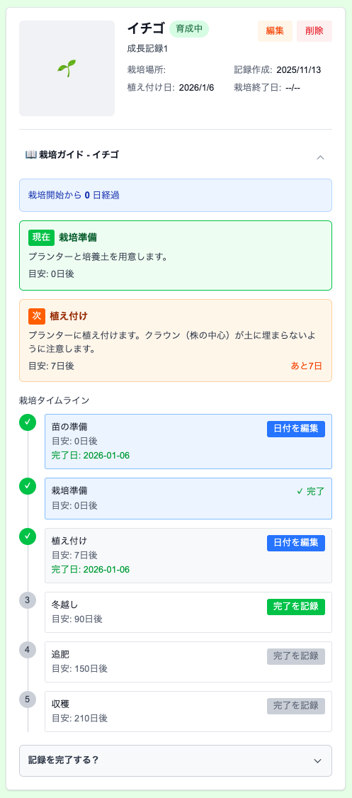
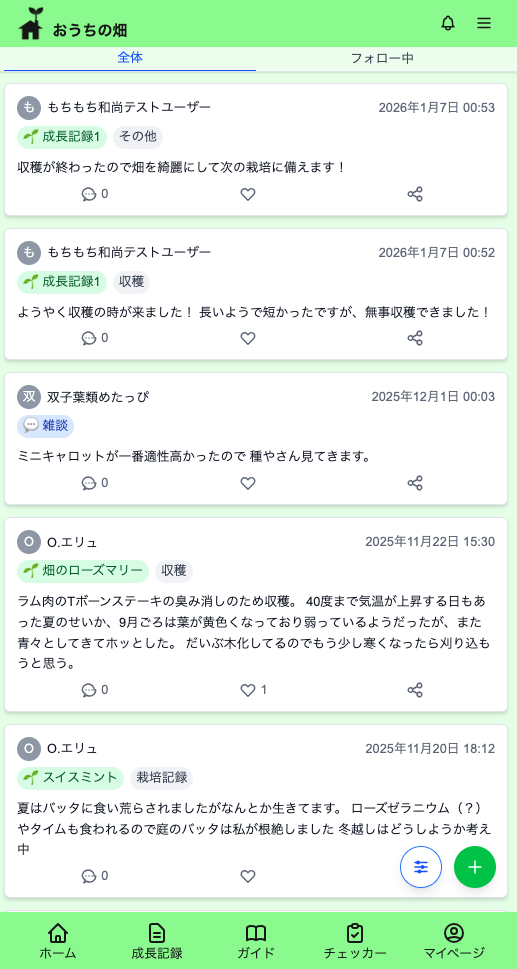
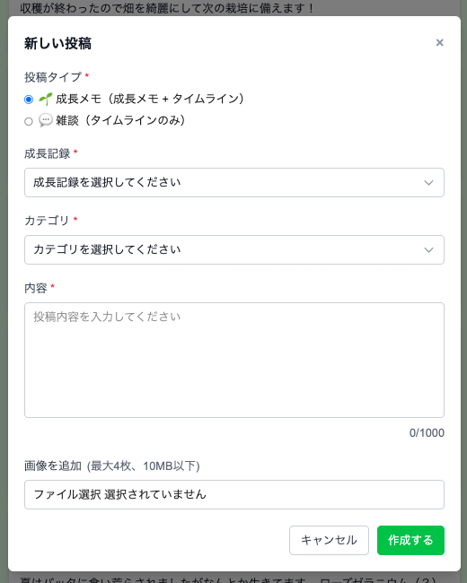
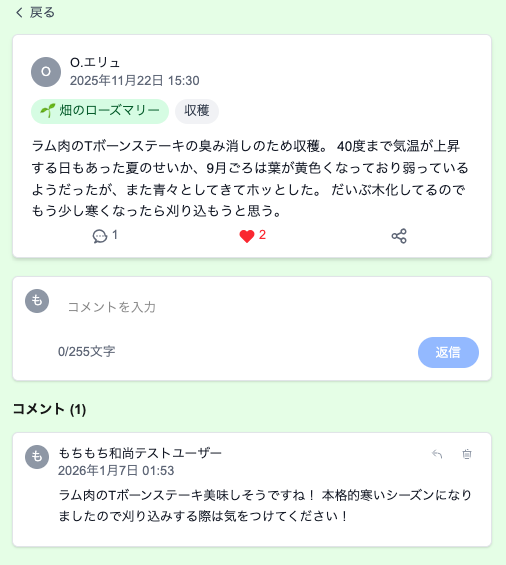

# おうちの畑

## サービス概要

本アプリは、**家庭菜園初心者やファミリー層が、迷わず・楽しく野菜づくりを続けられること**を目的とした家庭菜園支援サービスです。  
「何を育てればいいか分からない」「育て方が分からない」「続かない」といった初心者特有の課題を、**診断・ガイド・記録・共有**の4つの軸でサポートします。

家庭菜園チェッカーによる野菜提案、育て方ガイドによる栽培ステップの可視化、成長記録とタイムラインによる共有体験を通して、  
家庭菜園を**作業ではなく、体験として楽しめる**サービスを目指しています。

---

## 画面・操作イメージ（UI / UX）

### 家庭菜園チェッカー（診断）

**質問画面**
栽培場所や期間などの質問に答えるだけで、育てやすい野菜を診断できます。  
全6問の質問は進捗バー付きで表示され、初心者でも迷わず回答できる設計です。

**診断結果画面**
回答内容をもとに野菜をスコアリングし、ランキング形式でおすすめを表示します。  
診断結果から成長記録の作成やSNSシェア、再診断へとスムーズにつなげています。

---

### 成長記録

成長記録は、家庭菜園の取り組みを「振り返れる形」で残し、  
日々の作業や変化を可視化するための中核機能です。  
単なるメモではなく、**栽培の流れ・進捗・経験が自然に蓄積される設計**を重視しています。

#### 成長記録一覧

成長記録一覧では、現在育てている品種・育て終わった品種の記録を一覧で確認できます。  
各記録はステータス（計画中 / 育成中 / 完了 / 失敗）ごとに管理され、  
今どの野菜がどの段階にあるかを一目で把握できます。

---

#### 成長記録の作成

「記録を始める」ボタンから、新しい成長記録を作成できます。  
すでに育成が始まっているユーザーにも配慮し、  
**計画中・育成中のどちらからでも記録を開始可能**な設計としています。

- 品種は、育て方ガイドを提供している品種に加え、独自の品種も自由に登録可能  
- 記録名は自由入力（未入力の場合でも自動で番号付き名称を付与）  
- 栽培場所の選択が可能  
- 必要に応じてサムネイル画像を設定可能  

また、育て方ガイドが存在する品種を選択した場合は、  
そのガイドに基づいた**栽培ステップ付きの成長記録**が自動生成されます。

---

#### 成長記録詳細・栽培ガイド

成長記録の詳細画面では、選択した育て方ガイドに紐づく  
**栽培ステップをタイムライン形式で確認**できます。

- 各ステップの完了状況をチェックボックスで管理  
- いつ何を行ったか、次は何をすべきかが一目で分かる  
- 完了・未完了の履歴がそのまま経験として残る設計  

「次にやることが分からない」という初心者の不安を減らし、  
迷わず栽培を進められることを意識しています。

---

#### 成長メモ

日々の作業や気づきは「成長メモ」として記録できます。  
成長メモは必ず成長記録に紐づき、  
**個別の記録ページと全体のタイムラインの両方に表示**されます。

- 水やり・発芽・収穫などの出来事を気軽に記録  
- 写真付きでの投稿が可能  
- 成長の流れを後から振り返れる  

個人の記録としても、他ユーザーとの共有としても機能する設計です。

---

### タイムライン

タイムラインでは、全ユーザーの成長メモと雑談投稿が時系列で表示されます。  
個人の記録に閉じず、**他ユーザーの取り組みや知見に触れられる場**として設計しています。

#### 投稿一覧・フィルタリング

タイムラインには以下の投稿が表示されます。

- 成長記録に紐づく「成長メモ」
- 家庭菜園に関する雑談・質問投稿

投稿はフィルター機能により、

- 投稿種別（成長メモ / 雑談）
- フォロー中ユーザーのみ表示

といった切り替えが可能で、  
目的に応じて情報を整理して閲覧できます。

---

#### 投稿の作成

画面右下の投稿ボタンから、新しい投稿を作成できます。

- 成長メモ（成長記録 + タイムラインに表示）
- 雑談投稿（タイムラインのみ）

のいずれかを選択でき、  
成長メモの場合は、どの成長記録に紐づけるかを指定して投稿します。

---

#### 投稿詳細とコメント機能

各投稿はクリックすることで詳細画面に遷移し、  
その画面からコメントを投稿できます。

- タイムライン上は一覧性を重視し、UIをシンプルに保持  
- コメントは詳細画面に集約することで、投稿内容に集中できる設計  

これにより、  
**閲覧 → 興味を持った投稿のみ深掘り → コメントで交流**  
という自然なユーザー導線を実現しています。

---

#### 回遊導線とコミュニティ設計

投稿に表示されているタグや成長記録名から、

- 該当する成長記録の詳細
- 成長メモの一覧

へ遷移できるため、  
タイムラインを起点とした回遊が可能です。

単なる掲示板ではなく、  
**成長記録と連動したコミュニティ機能**として機能することを意識しています。

---

## サービスの利用フロー（概念）

1. ユーザー登録・ログイン（メール認証必須 / Google OAuth）
2. 家庭菜園チェッカーで質問に回答し、育てやすい野菜を見つける  
   （診断を使わず、任意の野菜を選ぶことも可能）
3. 育て方ガイドで栽培ステップを確認
4. 成長記録を作成し、日々の変化を記録
5. 記録内容をタイムラインで共有し、他のユーザーと交流

初心者が「次に何をすればいいか」で迷わないよう、  
**診断 → ガイド → 記録 → 共有**という一貫した導線を設計しています。

---

## サービスの差別化ポイント・推しポイント

### 初心者・ファミリー層に特化した設計
質問に答えるだけで野菜を選べる家庭菜園チェッカーと、  
観察日記形式の育て方ガイドにより、初めての家庭菜園でも安心して始められます。

### 成長記録 × コミュニティ
写真とメモで成長を振り返りながら、タイムラインで共有できる設計とし、  
育てる過程そのものを楽しめる体験を重視しています。

### 続けやすさを意識した記録設計
成長記録のステータス管理やガイドステップ連動により、  
途中で失敗しても「経験として残る」設計にしています。

---

## ユーザー層について

- 家庭菜園初心者
- 観葉植物・ハーブ経験者のライトガーデナー
- 親子で家庭菜園を楽しみたいファミリー層

「これから家庭菜園を始めたい人」を主なターゲットとしています。

---

## 技術スタック

### バックエンド
- Ruby on Rails 7.2.0（APIモード）
- PostgreSQL
- JWT 認証
- AWS S3（画像ストレージ）
- **Resend**（認証・パスワードリセットメール送信）

### フロントエンド
- React 19 + TypeScript
- Next.js 15（App Router）
- Tailwind CSS
- @react-oauth/google（Google OAuth）

### インフラ・開発環境
- Docker / Docker Compose
- GitHub Actions（CI）

---

## アーキテクチャ・構成概要

フロントエンド（Next.js）とバックエンド（Rails API）を分離した構成です。  
認証・認可やビジネスロジックは API 側で管理し、フロントエンドは UI / UX に集中できる構成としています。

画像は Active Storage を利用し、本番環境では AWS S3 に保存しています。

---

## 実装・設計上で工夫した点

- Service 層を導入し、Controller からビジネスロジックを分離
- フロントエンドとバックエンドで統一したレスポンス形式（ApiResult<T>）
- 型安全な API 通信とエラーハンドリングの統一
- 画像アップロード時のバリデーション（枚数・サイズ・Content-Type）
- N+1 問題を考慮したクエリ設計（includes の活用）

保守性・可読性を重視し、後から機能追加しやすい構造を意識しています。

---

## 設計判断とトレードオフ

本アプリでは、主要機能ごとに Service 層を設け、Controller からビジネスロジックを分離する設計を採用しています。  
認証、投稿、成長記録、家庭菜園チェッカーといった主要機能は、それぞれ専用の Service クラスで実装されています。

### 認証まわりの設計
認証機能は JWT を用いたトークンベースで実装しています。  
ログアウト時にはブラックリスト方式でトークンを無効化する構成とし、AuthService に認証関連の処理を集約しています。  
メール認証・パスワードリセット・Google OAuth 認証はいずれも同じ認証フロー上で扱えるよう実装しています。

### 投稿・タイムライン機能の設計
投稿は `post_type` を enum で管理し、一般投稿と成長記録投稿を同一テーブルで扱っています。  
成長記録投稿のみ `growth_record` に関連付けることで、投稿種別による分岐を最小限に抑えています。  
タイムライン取得時には関連データを `includes` でまとめて取得し、N+1 問題を回避しています。

### 成長記録と育て方ガイドの連動
成長記録作成時に、選択したガイドのステップを `GrowthRecordStep` として自動生成し、チェックリスト形式で進捗管理できるようにしています。  
ステータスは enum で管理し、失敗した場合でも記録が残る設計としています。

### 家庭菜園チェッカーのスコアリング設計
質問・選択肢・植物を中間テーブル（ChoiceScore）で管理し、スコアリング方式でおすすめを算出しています。  
栽培場所や野菜種類などの条件でスコアが 0 の植物は結果から除外するルールを設けています。

---

## 各機能

### 本リリース（完了）
- ユーザー認証（メール認証・パスワードリセット・Google OAuth）
- 家庭菜園チェッカー
- 育て方ガイド
- 成長記録管理
- タイムライン投稿
- いいね・コメント・返信
- フォロー機能
- 画像アップロード
- フィルタリング機能
- 通知機能（ドロップダウン形式）

---

## 実装範囲と未実装・今後の課題

- リマインダー機能
- 検索機能の拡張
- 家族共有機能
- 実績・バッジ機能 など

---

## 競合サービス

既存の栽培記録系・SNS系・栽培支援系サービスと比較し、  
初心者・ファミリー層に向けた分かりやすさと記録体験を重視した設計で差別化を図っています。

---

## ユーザーの獲得について

- 家庭菜園チェッカーによる未登録体験
- 成長記録・投稿によるコンテンツ蓄積
- いいね・コメント・フォローによる継続利用

---

## 動作環境・注意事項

企業ネットワーク等の制約により、アプリにアクセスできない場合があります。  
その際は本 README 内の画面・操作イメージをご参照ください。
